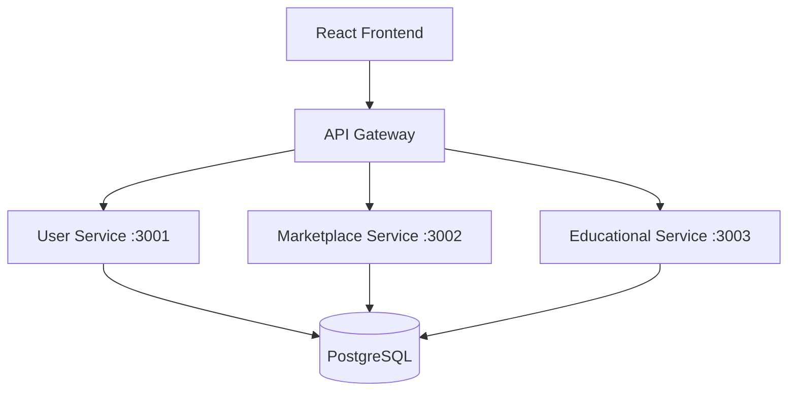

# 🌱 EcoWaste Management System

[](https://opensource.org/licenses/MIT)
[](https://nodejs.org/)
[](https://reactjs.org/)
[](https://www.typescriptlang.org/)
[](https://www.postgresql.org/)

> **A modern, comprehensive waste management platform transforming how communities handle waste through technology, education, and sustainable marketplace solutions.**

## 📋 Table of Contents

- [🌟 Features](#-features)
- [🏗️ Architecture](#️-architecture)
- [🚀 Quick Start](#-quick-start)
- [⚙️ Installation](#️-installation)
- [🔧 Configuration](#-configuration)
- [📁 Project Structure](#-project-structure)
- [🛠️ Technology Stack](#️-technology-stack)
- [📚 API Documentation](#-api-documentation)
- [🏃‍♂️ Usage](#️-usage)
- [🚢 Deployment](#-deployment)
- [📸 Screenshots](#-screenshots)
- [🤝 Contributing](#-contributing)
- [📄 License](#-license)

## 🌟 Features

### 🎯 **Core Platform Features**
- **Smart Waste Tracking** - Monitor and categorize waste generation patterns
- **Recycling Marketplace** - Buy/sell recyclable materials and upcycled products
- **Educational Hub** - Interactive learning modules on sustainability
- **Community Dashboard** - Real-time waste management analytics
- **User Authentication** - Secure JWT-based authentication system

### 🖥️ **Frontend Features**
- **Modern React UI** - Built with React 19 + TypeScript
- **Responsive Design** - Mobile-first approach with Tailwind CSS
- **Interactive Components** - Smooth animations with Framer Motion
- **Form Management** - Robust forms with React Hook Form + Zod validation
- **Real-time Updates** - Live data synchronization across services

### ⚡ **Backend Features**
- **Microservices Architecture** - Scalable, maintainable service separation
- **RESTful APIs** - Well-documented endpoints for all services
- **Database Management** - PostgreSQL with connection pooling
- **Authentication & Authorization** - JWT tokens with role-based access
- **Error Handling** - Comprehensive error management and logging

## 🏗️ Architecture

This platform follows a **microservices architecture** with clear separation of concerns:



## 🚀 Quick Start

### Prerequisites
- **Node.js 18+** 
- **PostgreSQL 12+**
- **npm or yarn**

### ⚡ One-Command Setup
```bash
# Clone and setup everything
git clone https://github.com/faraz66/WasteManagement.git
cd WasteManagement

# Install all dependencies
cd backend && npm run install:all && cd ../frontend && npm install && cd ..

# Start all services
./start-backend.sh & ./start-frontend.sh
```

**🎉 That's it! Your app will be running at:**
- **Frontend**: http://localhost:5176
- **Backend Services**: http://localhost:3001-3003

## ⚙️ Installation

### 📋 Step-by-Step Setup

#### 1. **Clone Repository**
```bash
git clone https://github.com/faraz66/WasteManagement.git
cd WasteManagement
```

#### 2. **Backend Setup**
```bash
cd backend

# Install dependencies for all microservices
npm run install:all

# Setup environment variables
cp .env.example .env
# Edit .env with your database credentials
```

#### 3. **Frontend Setup**
```bash
cd ../frontend

# Install dependencies
npm install

# Setup environment variables
cp .env.example .env
# Configure API endpoints
```

#### 4. **Database Setup**
```bash
# Create PostgreSQL databases
createdb waste_management_users
createdb waste_marketplace
createdb education_db

# Run migrations (from backend directory)
cd backend
npm run setup:db
```

## 🔧 Configuration

### 🔧 Environment Variables

**Backend Configuration** (`backend/.env`):
```bash
# Database Configuration
PGUSER=your_postgres_username
PGHOST=localhost
PGPASSWORD=your_postgres_password
PGPORT=5432

# JWT Configuration
JWT_SECRET=your_super_secret_jwt_key_change_this_in_production
JWT_EXPIRES_IN=7d

# Service Ports
USER_SERVICE_PORT=3001
MARKETPLACE_SERVICE_PORT=3002
EDUCATION_SERVICE_PORT=3003

# CORS Origins
FRONTEND_URLS=http://localhost:5173,http://localhost:5174,http://localhost:5175
```

**Frontend Configuration** (`frontend/.env`):
```bash
# Backend API URLs
VITE_USER_SERVICE_URL=http://localhost:3001
VITE_MARKETPLACE_SERVICE_URL=http://localhost:3002
VITE_EDUCATION_SERVICE_URL=http://localhost:3003

# Application Configuration
VITE_APP_NAME=EcoWaste Management
VITE_APP_VERSION=1.0.0
```

## 📁 Project Structure

```
WasteManagement/
├── 📁 frontend/                    # React + TypeScript + Tailwind CSS
│   ├── 📁 src/
│   │   ├── 📁 components/         # Reusable UI components
│   │   ├── 📁 pages/             # Application pages (Auth, Dashboard, etc.)
│   │   ├── 📁 contexts/          # React contexts (Auth, Theme, etc.)
│   │   ├── 📁 services/          # API service layer
│   │   ├── 📁 hooks/             # Custom React hooks
│   │   ├── 📁 utils/             # Utility functions
│   │   └── 📁 lib/               # Third-party library configurations
│   ├── 📁 public/                # Static assets
│   ├── 📄 package.json           # Frontend dependencies
│   ├── 📄 vite.config.ts         # Vite configuration
│   ├── 📄 tailwind.config.js     # Tailwind CSS configuration
│   └── 📄 tsconfig.json          # TypeScript configuration
│
├── 📁 backend/                    # Node.js microservices architecture
│   ├── 📁 shared/                # Shared utilities across services
│   │   ├── 📁 database/          # Database connection pooling
│   │   ├── 📁 utils/             # Response handlers, helpers
│   │   ├── 📁 constants/         # Application constants
│   │   └── 📁 middleware/        # JWT auth, CORS, logging
│   │
│   ├── 📁 user-service/          # Authentication & user management
│   │   ├── 📁 src/               # Source code (MVC architecture)
│   │   │   ├── 📁 controllers/   # Request handlers
│   │   │   ├── 📁 services/      # Business logic
│   │   │   ├── 📁 models/        # Data models
│   │   │   ├── 📁 routes/        # API routes
│   │   │   ├── 📁 middleware/    # Service-specific middleware
│   │   │   └── 📁 validators/    # Input validation schemas
│   │   ├── 📁 database/          # Migrations & seeds
│   │   ├── 📁 tests/             # Unit & integration tests
│   │   └── 📄 server.js          # Service entry point
│   │
│   ├── 📁 marketplace-service/   # Product listings & marketplace
│   ├── 📁 educational-content-service/  # Learning materials & courses
│   ├── 📄 package.json           # Backend dependencies
│   └── 📄 .env.example           # Environment configuration template
│
├── 📄 start-frontend.sh          # Frontend development server script
├── 📄 start-backend.sh           # Backend services startup script
├── 📄 .gitignore                 # Git ignore rules
└── 📄 README.md                  # This file
```

## 🛠️ Technology Stack

### **Frontend Technologies**
| Technology | Version | Purpose |
|------------|---------|---------|
| **React** | 19.1.1 | UI framework |
| **TypeScript** | 5.0+ | Type safety |
| **Vite** | Latest | Build tool & dev server |
| **Tailwind CSS** | 4.0 | Utility-first CSS framework |
| **Framer Motion** | 12.23+ | Animations & transitions |
| **React Hook Form** | 7.62+ | Form management |
| **Zod** | 4.0+ | Schema validation |
| **Axios** | 1.11+ | HTTP client |
| **React Router** | 7.8+ | Client-side routing |

### **Backend Technologies**
| Technology | Version | Purpose |
|------------|---------|---------|
| **Node.js** | 18+ | Runtime environment |
| **Express.js** | Latest | Web framework |
| **PostgreSQL** | 12+ | Primary database |
| **JWT** | Latest | Authentication |
| **bcrypt** | Latest | Password hashing |
| **CORS** | Latest | Cross-origin requests |
| **dotenv** | Latest | Environment variables |

## 📚 API Documentation

### **🔐 Authentication Endpoints** (Port 3001)
```http
POST   /api/auth/register     # User registration
POST   /api/auth/login        # User login
POST   /api/auth/refresh      # Refresh JWT token
GET    /api/auth/profile      # Get user profile
PUT    /api/auth/profile      # Update user profile
```

### **🛒 Marketplace Endpoints** (Port 3002)
```http
GET    /api/products          # Get all products
POST   /api/products          # Create new product
GET    /api/products/:id      # Get product by ID
PUT    /api/products/:id      # Update product
DELETE /api/products/:id      # Delete product
GET    /api/categories        # Get all categories
```

### **📚 Educational Endpoints** (Port 3003)
```http
GET    /api/courses           # Get all courses
GET    /api/courses/:id       # Get course by ID
POST   /api/courses           # Create new course
GET    /api/lessons/:id       # Get lesson content
POST   /api/progress          # Track learning progress
```

## 🏃‍♂️ Usage

### **Development Mode**
```bash
# Start all services in development mode
./start-backend.sh & ./start-frontend.sh

# Or manually:
cd backend && npm run dev:backend
cd frontend && npm run dev
```

### **Production Build**
```bash
# Build frontend for production
cd frontend && npm run build

# Start backend in production mode
cd backend && npm start
```

### **Testing**
```bash
# Run backend tests
cd backend && npm test

# Run frontend tests
cd frontend && npm test
```

## 🚢 Deployment

### **Docker Deployment** (Recommended)
```bash
# Build and run with Docker Compose
docker-compose up --build

# Run in production mode
docker-compose -f docker-compose.prod.yml up -d
```

### **Manual Deployment**
1. **Build frontend**: `cd frontend && npm run build`
2. **Setup production database**: Configure PostgreSQL
3. **Set environment variables**: Update `.env` files
4. **Start services**: Use PM2 or similar process manager

## 📸 Screenshots

### 🏠 **Dashboard Overview**
> *Screenshot placeholder - Main dashboard with waste tracking analytics*

### 🛒 **Marketplace Interface**
> *Screenshot placeholder - Product listings and marketplace features*

### 📚 **Educational Hub**
> *Screenshot placeholder - Learning modules and progress tracking*

### 📱 **Mobile Responsive Design**
> *Screenshot placeholder - Mobile-optimized interface*

## 🤝 Contributing

We welcome contributions! Please follow these guidelines:

### **Development Workflow**
1. **Fork** the repository
2. **Create** a feature branch: `git checkout -b feature/amazing-feature`
3. **Commit** your changes: `git commit -m 'Add amazing feature'`
4. **Push** to the branch: `git push origin feature/amazing-feature`
5. **Open** a Pull Request

### **Code Standards**
- **Frontend**: Follow React/TypeScript best practices
- **Backend**: Use ESLint and Prettier configurations
- **Database**: Follow PostgreSQL naming conventions
- **Testing**: Write unit tests for new features

### **Pull Request Guidelines**
- Provide clear description of changes
- Include relevant tests
- Update documentation if needed
- Ensure all CI checks pass

## 📄 License

This project is licensed under the **MIT License** - see the [LICENSE](LICENSE) file for details.

---

<div align="center">

**🌱 Built with ❤️ for a sustainable future**

[Report Bug](https://github.com/faraz66/WasteManagement/issues) • [Request Feature](https://github.com/faraz66/WasteManagement/issues) • [Documentation](https://github.com/faraz66/WasteManagement/wiki)

</div>

**Solutions:**
```bash
# Kill processes on backend ports
lsof -ti:3001 | xargs kill -9
lsof -ti:3002 | xargs kill -9
lsof -ti:3003 | xargs kill -9

# Kill frontend processes
lsof -ti:5173 | xargs kill -9
lsof -ti:5174 | xargs kill -9
lsof -ti:5175 | xargs kill -9

# Or use the startup scripts (they handle cleanup)
./start-backend.sh
./start-frontend.sh
```

#### 🔴 JWT Authentication Issues

**Error**: `JsonWebTokenError` or `invalid token`

**Solutions:**
```bash
# Ensure JWT_SECRET is set in all service .env files
grep -r "JWT_SECRET" backend/*/\.env

# Regenerate JWT secret
node -e "console.log(require('crypto').randomBytes(64).toString('hex'))"

# Update all service .env files with the same JWT_SECRET
```

#### 🔴 CORS Errors

**Error**: `Access to fetch at 'http://localhost:3001' from origin 'http://localhost:5173' has been blocked by CORS policy`

**Solutions:**
```bash
# Check CORS configuration in backend services
grep -r "cors" backend/*/server.js

# Verify frontend URLs in backend .env
grep "FRONTEND_URLS" backend/.env

# Restart backend services after CORS changes
./start-backend.sh
```

#### 🔴 TailwindCSS v4 Issues

**Error**: `Unknown at rule @apply` or `@theme`

**Solutions:**
```bash
# Ensure TailwindCSS v4 is properly installed
cd frontend
npm install @tailwindcss/vite@next

# Check vite.config.ts has TailwindCSS plugin
grep -A5 "plugins" vite.config.ts

# Verify index.css has correct imports
head -5 src/index.css
```

#### 🔴 Environment Variables Not Loading

**Error**: `undefined` values for environment variables

**Solutions:**
```bash
# Check .env files exist
ls -la backend/.env frontend/.env

# Verify .env file format (no spaces around =)
cat backend/.env | grep -E "^[A-Z_]+=.*"

# Restart services after .env changes
./start-backend.sh
./start-frontend.sh
```

#### 🔴 Node Modules Issues

**Error**: Module resolution errors or version conflicts

**Solutions:**
```bash
# Clean install backend dependencies
cd backend
rm -rf node_modules package-lock.json
rm -rf */node_modules */package-lock.json
npm run install:all

# Clean install frontend dependencies
cd ../frontend
rm -rf node_modules package-lock.json
npm install

# Clear npm cache if needed
npm cache clean --force
```

### 🔍 Debug Mode

**Enable detailed logging:**
```bash
# Backend debug mode
cd backend
DEBUG=* npm run dev:backend

# Frontend debug mode
cd frontend
DEBUG=* npm run dev
```

**Check service health:**
```bash
# Test backend endpoints
curl http://localhost:3001/health
curl http://localhost:3002/health
curl http://localhost:3003/health

# Check database connections
psql -d waste_marketplace_users -c "SELECT version();"
```

### 📞 Getting Help

If you encounter issues not covered here:

1. **Check Logs**: Look at terminal output for specific error messages
2. **Verify Prerequisites**: Ensure Node.js 18+, PostgreSQL 12+ are installed
3. **Environment Files**: Double-check all .env files are properly configured
4. **Port Conflicts**: Ensure no other applications are using ports 3001-3003, 5173
5. **Database Access**: Verify PostgreSQL user has createdb permissions

## 🌐 API Documentation

### Service Endpoints

- **User Service**: http://localhost:3001/api/auth, http://localhost:3001/api/users
- **Marketplace Service**: http://localhost:3002/api/products, http://localhost:3002/api/categories  
- **Education Service**: http://localhost:3003/api/courses, http://localhost:3003/api/articles

### Health Checks

- http://localhost:3001/health
- http://localhost:3002/health  
- http://localhost:3003/health

## 🤝 Contributing

Contributions are welcome! Please follow these steps:

1. Fork the repository
2. Create your feature branch (`git checkout -b feature/AmazingFeature`)
3. Commit your changes (`git commit -m 'Add some AmazingFeature'`)
4. Push to the branch (`git push origin feature/AmazingFeature`)
5. Open a Pull Request

## 📝 License

This project is licensed under the MIT License - see the [LICENSE](LICENSE) file for details.

## 🙏 Acknowledgments

- All contributors who have helped in developing this project
- Open source libraries and frameworks used in this project
