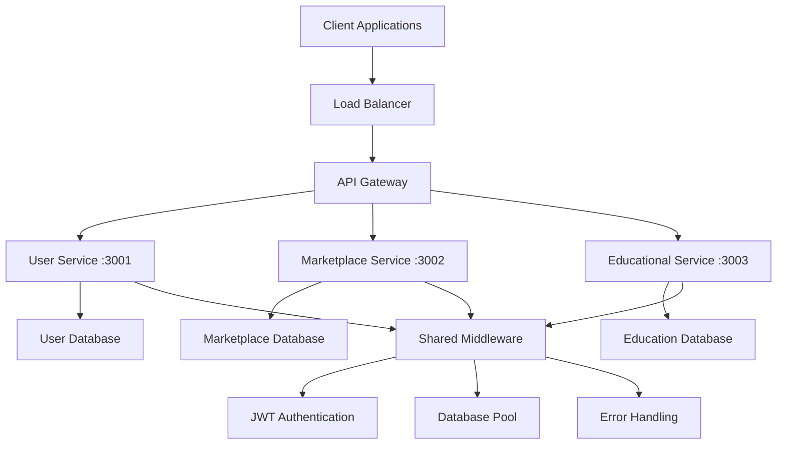

# 🚀 EcoWaste Management Backend

[](https://nodejs.org/)
[](https://expressjs.com/)
[](https://www.postgresql.org/)
[](https://jwt.io/)
[](https://microservices.io/)

> **Enterprise-grade Node.js microservices backend powering the EcoWaste Management platform with scalable architecture, robust authentication, and comprehensive API endpoints.**

## 📋 Table of Contents

- [🏗️ Architecture Overview](#️-architecture-overview)
- [🚀 Quick Start](#-quick-start)
- [📁 Project Structure](#-project-structure)
- [🛠️ Technology Stack](#️-technology-stack)
- [⚙️ Installation & Setup](#️-installation--setup)
- [🔧 Configuration](#-configuration)
- [📚 API Documentation](#-api-documentation)
- [🗄️ Database Schema](#️-database-schema)
- [🧪 Testing](#-testing)
- [🚢 Deployment](#-deployment)
- [🔒 Security](#-security)
- [📊 Monitoring & Logging](#-monitoring--logging)
- [🤝 Contributing](#-contributing)

## 🏗️ Architecture Overview

This backend implements a **microservices architecture** with clear separation of concerns and scalable design patterns:



### **🎯 Core Services**

| Service | Port | Purpose | Database |
|---------|------|---------|----------|
| **User Service** | 3001 | Authentication, user management, profiles | `waste_management_users` |
| **Marketplace Service** | 3002 | Product listings, transactions, categories | `waste_marketplace` |
| **Educational Service** | 3003 | Learning content, courses, progress tracking | `education_db` |

## 🚀 Quick Start

### **Prerequisites**
- **Node.js 18+** (LTS recommended)
- **PostgreSQL 12+** with createdb permissions
- **npm 8+** or **yarn 1.22+**

### **⚡ One-Command Setup**
```bash
# Install all microservice dependencies
npm run install:all

# Setup databases and start all services
npm run dev:backend
```

**🎉 Services will be running at:**
- **User Service**: http://localhost:3001
- **Marketplace Service**: http://localhost:3002  
- **Educational Service**: http://localhost:3003

## 📁 Project Structure

```
backend/
├── 📁 shared/                     # Shared utilities across all services
│   ├── 📁 database/              # Database connection pooling & utilities
│   │   ├── 📄 connection.js      # PostgreSQL connection pool
│   │   ├── 📄 migrations.js      # Database migration utilities
│   │   └── 📄 seeds.js           # Sample data seeding
│   ├── 📁 utils/                 # Common utilities & helpers
│   │   ├── 📄 response.js        # Standardized API responses
│   │   ├── 📄 validation.js      # Input validation helpers
│   │   ├── 📄 logger.js          # Centralized logging
│   │   └── 📄 helpers.js         # General utility functions
│   ├── 📁 constants/             # Application-wide constants
│   │   ├── 📄 errors.js          # Error codes & messages
│   │   ├── 📄 roles.js           # User roles & permissions
│   │   └── 📄 status.js          # HTTP status codes
│   └── 📁 middleware/            # Shared middleware functions
│       ├── 📄 auth.js            # JWT authentication middleware
│       ├── 📄 cors.js            # CORS configuration
│       ├── 📄 rateLimit.js       # Rate limiting
│       └── 📄 errorHandler.js    # Global error handling
│
├── 📁 user-service/              # 🔐 Authentication & User Management
│   ├── 📁 src/                   # Source code (MVC architecture)
│   │   ├── 📁 controllers/       # Request handlers & business logic
│   │   │   ├── 📄 authController.js      # Authentication endpoints
│   │   │   ├── 📄 userController.js      # User management
│   │   │   └── 📄 profileController.js   # User profiles
│   │   ├── 📁 services/          # Business logic layer
│   │   │   ├── 📄 authService.js         # Authentication logic
│   │   │   ├── 📄 userService.js         # User operations
│   │   │   └── 📄 emailService.js        # Email notifications
│   │   ├── 📁 models/            # Data models & schemas
│   │   │   ├── 📄 User.js                # User model
│   │   │   ├── 📄 Profile.js             # Profile model
│   │   │   └── 📄 Session.js             # Session model
│   │   ├── 📁 routes/            # API route definitions
│   │   │   ├── 📄 auth.js                # Authentication routes
│   │   │   ├── 📄 users.js               # User management routes
│   │   │   └── 📄 profiles.js            # Profile routes
│   │   ├── 📁 middleware/        # Service-specific middleware
│   │   │   ├── 📄 validation.js          # Input validation
│   │   │   └── 📄 permissions.js         # Role-based access
│   │   └── 📁 validators/        # Input validation schemas
│   │       ├── 📄 authValidators.js      # Auth validation rules
│   │       └── 📄 userValidators.js      # User validation rules
│   ├── 📁 database/              # Database-specific files
│   │   ├── 📁 migrations/        # Database schema migrations
│   │   └── 📁 seeds/             # Sample/test data
│   ├── 📁 tests/                 # Unit & integration tests
│   │   ├── 📁 unit/              # Unit tests
│   │   ├── 📁 integration/       # Integration tests
│   │   └── 📄 setup.js           # Test configuration
│   ├── 📄 .env                   # Environment variables
│   ├── 📄 server.js              # Service entry point
│   └── 📄 package.json           # Service dependencies
│
├── 📁 marketplace-service/       # 🛒 Product Listings & Marketplace
│   └── [Same structure as user-service]
│
├── 📁 educational-content-service/ # 📚 Learning Materials & Courses
│   └── [Same structure as user-service]
│
├── 📄 package.json               # Root package.json for shared scripts
├── 📄 .env.example               # Environment configuration template
├── 📄 docker-compose.yml         # Docker development setup
├── 📄 docker-compose.prod.yml    # Docker production setup
└── 📄 README_Backend.md          # This file
```

## 🛠️ Technology Stack

### **Core Technologies**
| Technology | Version | Purpose |
|------------|---------|---------|
| **Node.js** | 18+ | JavaScript runtime environment |
| **Express.js** | 4.x | Web application framework |
| **PostgreSQL** | 12+ | Primary database system |
| **JWT** | Latest | Authentication & authorization |
| **bcrypt** | Latest | Password hashing |
| **dotenv** | Latest | Environment variable management |

### **Development & Testing**
| Technology | Version | Purpose |
|------------|---------|---------|
| **Jest** | Latest | Testing framework |
| **Supertest** | Latest | HTTP assertion library |
| **nodemon** | Latest | Development auto-restart |
| **concurrently** | Latest | Run multiple services |
| **ESLint** | Latest | Code linting |
| **Prettier** | Latest | Code formatting |

### **Production & Monitoring**
| Technology | Version | Purpose |
|------------|---------|---------|
| **PM2** | Latest | Process management |
| **Winston** | Latest | Logging framework |
| **Helmet** | Latest | Security middleware |
| **CORS** | Latest | Cross-origin resource sharing |
| **express-rate-limit** | Latest | Rate limiting |

## ⚙️ Installation & Setup

### **1. Clone & Navigate**
```bash
git clone https://github.com/faraz66/WasteManagement.git
cd WasteManagement/backend
```

### **2. Install Dependencies**
```bash
# Install dependencies for all microservices
npm run install:all

# Or install individually
cd user-service && npm install
cd ../marketplace-service && npm install  
cd ../educational-content-service && npm install
```

### **3. Database Setup**
```bash
# Create PostgreSQL databases
createdb waste_management_users
createdb waste_marketplace
createdb education_db

# Verify databases
psql -l | grep waste
```

### **4. Environment Configuration**
```bash
# Copy environment template
cp .env.example .env

# Edit configuration
nano .env
```

## 🔧 Configuration

### **Environment Variables**

**Root Configuration** (`.env`):
```bash
# Database Configuration
PGUSER=your_postgres_username
PGHOST=localhost
PGPASSWORD=your_postgres_password
PGPORT=5432

# JWT Configuration
JWT_SECRET=your_super_secret_jwt_key_change_this_in_production
JWT_EXPIRES_IN=7d

# Service Ports
USER_SERVICE_PORT=3001
MARKETPLACE_SERVICE_PORT=3002
EDUCATION_SERVICE_PORT=3003

# CORS Origins
FRONTEND_URLS=http://localhost:5173,http://localhost:5174

# Email Configuration (Optional)
SMTP_HOST=smtp.gmail.com
SMTP_PORT=587
SMTP_USER=your_email@gmail.com
SMTP_PASS=your_app_password
```

### **Service-Specific Configuration**

Each microservice requires its own `.env` file:

```bash
# Create service-specific environment files
echo "PORT=3001\nPGDATABASE=waste_management_users" > user-service/.env
echo "PORT=3002\nPGDATABASE=waste_marketplace" > marketplace-service/.env
echo "PORT=3003\nPGDATABASE=education_db" > educational-content-service/.env
```

## 📚 API Documentation

### **🔐 User Service API** (Port 3001)

#### Authentication Endpoints
```http
POST   /api/auth/register          # User registration
POST   /api/auth/login             # User login
POST   /api/auth/refresh           # Refresh JWT token
POST   /api/auth/logout            # User logout
POST   /api/auth/forgot-password   # Password reset request
POST   /api/auth/reset-password    # Password reset confirmation
```

#### User Management Endpoints
```http
GET    /api/users                 # Get all users (Admin only)
GET    /api/users/:id             # Get user by ID
PUT    /api/users/:id             # Update user
DELETE /api/users/:id             # Delete user (Admin only)
GET    /api/users/profile         # Get current user profile
PUT    /api/users/profile         # Update current user profile
```

#### Example Request/Response
```javascript
// POST /api/auth/register
{
  "email": "user@example.com",
  "password": "securePassword123",
  "firstName": "John",
  "lastName": "Doe",
  "role": "user"
}

// Response
{
  "success": true,
  "message": "User registered successfully",
  "data": {
    "user": {
      "id": 1,
      "email": "user@example.com",
      "firstName": "John",
      "lastName": "Doe",
      "role": "user"
    },
    "token": "eyJhbGciOiJIUzI1NiIsInR5cCI6IkpXVCJ9..."
  }
}
```

### **🛒 Marketplace Service API** (Port 3002)

#### Product Endpoints
```http
GET    /api/products              # Get all products (with pagination)
POST   /api/products              # Create new product
GET    /api/products/:id          # Get product by ID
PUT    /api/products/:id          # Update product
DELETE /api/products/:id          # Delete product
GET    /api/products/search       # Search products
GET    /api/products/category/:id # Get products by category
```

#### Category Endpoints
```http
GET    /api/categories            # Get all categories
POST   /api/categories            # Create new category (Admin only)
PUT    /api/categories/:id        # Update category (Admin only)
DELETE /api/categories/:id        # Delete category (Admin only)
```

#### Transaction Endpoints
```http
GET    /api/transactions          # Get user transactions
POST   /api/transactions          # Create new transaction
GET    /api/transactions/:id      # Get transaction by ID
PUT    /api/transactions/:id      # Update transaction status
```

### **📚 Educational Service API** (Port 3003)

#### Course Endpoints
```http
GET    /api/courses               # Get all courses
POST   /api/courses               # Create new course (Admin only)
GET    /api/courses/:id           # Get course by ID
PUT    /api/courses/:id           # Update course (Admin only)
DELETE /api/courses/:id           # Delete course (Admin only)
GET    /api/courses/:id/lessons   # Get course lessons
```

#### Lesson Endpoints
```http
GET    /api/lessons/:id           # Get lesson content
POST   /api/lessons               # Create new lesson (Admin only)
PUT    /api/lessons/:id           # Update lesson (Admin only)
DELETE /api/lessons/:id           # Delete lesson (Admin only)
```

#### Progress Tracking
```http
GET    /api/progress              # Get user progress
POST   /api/progress              # Update learning progress
GET    /api/progress/course/:id   # Get course progress
POST   /api/progress/complete     # Mark lesson as complete
```

## 🗄️ Database Schema

### **User Service Database** (`waste_management_users`)

```sql
-- Users table
CREATE TABLE users (
    id SERIAL PRIMARY KEY,
    email VARCHAR(255) UNIQUE NOT NULL,
    password_hash VARCHAR(255) NOT NULL,
    first_name VARCHAR(100) NOT NULL,
    last_name VARCHAR(100) NOT NULL,
    role VARCHAR(50) DEFAULT 'user',
    is_active BOOLEAN DEFAULT true,
    email_verified BOOLEAN DEFAULT false,
    created_at TIMESTAMP DEFAULT CURRENT_TIMESTAMP,
    updated_at TIMESTAMP DEFAULT CURRENT_TIMESTAMP
);

-- User profiles table
CREATE TABLE user_profiles (
    id SERIAL PRIMARY KEY,
    user_id INTEGER REFERENCES users(id) ON DELETE CASCADE,
    phone VARCHAR(20),
    address TEXT,
    city VARCHAR(100),
    country VARCHAR(100),
    avatar_url VARCHAR(500),
    bio TEXT,
    created_at TIMESTAMP DEFAULT CURRENT_TIMESTAMP,
    updated_at TIMESTAMP DEFAULT CURRENT_TIMESTAMP
);

-- Sessions table
CREATE TABLE user_sessions (
    id SERIAL PRIMARY KEY,
    user_id INTEGER REFERENCES users(id) ON DELETE CASCADE,
    token_hash VARCHAR(255) NOT NULL,
    expires_at TIMESTAMP NOT NULL,
    created_at TIMESTAMP DEFAULT CURRENT_TIMESTAMP
);
```

### **Marketplace Database** (`waste_marketplace`)

```sql
-- Categories table
CREATE TABLE categories (
    id SERIAL PRIMARY KEY,
    name VARCHAR(100) NOT NULL,
    description TEXT,
    icon VARCHAR(100),
    created_at TIMESTAMP DEFAULT CURRENT_TIMESTAMP
);

-- Products table
CREATE TABLE products (
    id SERIAL PRIMARY KEY,
    seller_id INTEGER NOT NULL,
    category_id INTEGER REFERENCES categories(id),
    title VARCHAR(200) NOT NULL,
    description TEXT,
    price DECIMAL(10,2) NOT NULL,
    condition VARCHAR(50),
    location VARCHAR(200),
    images TEXT[], -- Array of image URLs
    status VARCHAR(50) DEFAULT 'active',
    created_at TIMESTAMP DEFAULT CURRENT_TIMESTAMP,
    updated_at TIMESTAMP DEFAULT CURRENT_TIMESTAMP
);

-- Transactions table
CREATE TABLE transactions (
    id SERIAL PRIMARY KEY,
    product_id INTEGER REFERENCES products(id),
    buyer_id INTEGER NOT NULL,
    seller_id INTEGER NOT NULL,
    amount DECIMAL(10,2) NOT NULL,
    status VARCHAR(50) DEFAULT 'pending',
    created_at TIMESTAMP DEFAULT CURRENT_TIMESTAMP,
    completed_at TIMESTAMP
);
```

### **Education Database** (`education_db`)

```sql
-- Courses table
CREATE TABLE courses (
    id SERIAL PRIMARY KEY,
    title VARCHAR(200) NOT NULL,
    description TEXT,
    instructor VARCHAR(100),
    duration_hours INTEGER,
    difficulty_level VARCHAR(50),
    thumbnail_url VARCHAR(500),
    is_published BOOLEAN DEFAULT false,
    created_at TIMESTAMP DEFAULT CURRENT_TIMESTAMP,
    updated_at TIMESTAMP DEFAULT CURRENT_TIMESTAMP
);

-- Lessons table
CREATE TABLE lessons (
    id SERIAL PRIMARY KEY,
    course_id INTEGER REFERENCES courses(id) ON DELETE CASCADE,
    title VARCHAR(200) NOT NULL,
    content TEXT,
    video_url VARCHAR(500),
    duration_minutes INTEGER,
    order_index INTEGER,
    created_at TIMESTAMP DEFAULT CURRENT_TIMESTAMP
);

-- User progress table
CREATE TABLE user_progress (
    id SERIAL PRIMARY KEY,
    user_id INTEGER NOT NULL,
    course_id INTEGER REFERENCES courses(id),
    lesson_id INTEGER REFERENCES lessons(id),
    completed BOOLEAN DEFAULT false,
    progress_percentage INTEGER DEFAULT 0,
    completed_at TIMESTAMP,
    created_at TIMESTAMP DEFAULT CURRENT_TIMESTAMP
);
```

## 🧪 Testing

### **Running Tests**
```bash
# Run all tests
npm test

# Run tests for specific service
cd user-service && npm test
cd marketplace-service && npm test
cd educational-content-service && npm test

# Run tests with coverage
npm run test:coverage

# Run tests in watch mode
npm run test:watch
```

### **Test Structure**
```
tests/
├── unit/                    # Unit tests
│   ├── controllers/         # Controller tests
│   ├── services/           # Service layer tests
│   └── models/             # Model tests
├── integration/            # Integration tests
│   ├── auth.test.js        # Authentication flow tests
│   ├── products.test.js    # Product management tests
│   └── courses.test.js     # Course management tests
└── setup.js               # Test configuration
```

### **Example Test**
```javascript
// tests/integration/auth.test.js
const request = require('supertest');
const app = require('../../src/app');

describe('Authentication', () => {
  test('should register a new user', async () => {
    const userData = {
      email: 'test@example.com',
      password: 'password123',
      firstName: 'Test',
      lastName: 'User'
    };

    const response = await request(app)
      .post('/api/auth/register')
      .send(userData)
      .expect(201);

    expect(response.body.success).toBe(true);
    expect(response.body.data.user.email).toBe(userData.email);
    expect(response.body.data.token).toBeDefined();
  });
});
```

## 🚢 Deployment

### **Docker Deployment** (Recommended)

```bash
# Build and run with Docker Compose
docker-compose up --build

# Production deployment
docker-compose -f docker-compose.prod.yml up -d
```

**Docker Compose Configuration:**
```yaml
# docker-compose.yml
version: '3.8'
services:
  postgres:
    image: postgres:13
    environment:
      POSTGRES_DB: waste_management
      POSTGRES_USER: postgres
      POSTGRES_PASSWORD: password
    ports:
      - "5432:5432"
    volumes:
      - postgres_data:/var/lib/postgresql/data

  user-service:
    build: ./user-service
    ports:
      - "3001:3001"
    depends_on:
      - postgres
    environment:
      - NODE_ENV=production
      - PGHOST=postgres

  marketplace-service:
    build: ./marketplace-service
    ports:
      - "3002:3002"
    depends_on:
      - postgres

  educational-service:
    build: ./educational-content-service
    ports:
      - "3003:3003"
    depends_on:
      - postgres

volumes:
  postgres_data:
```

### **Manual Deployment**

```bash
# 1. Setup production environment
export NODE_ENV=production

# 2. Install PM2 globally
npm install -g pm2

# 3. Start services with PM2
pm2 start ecosystem.config.js

# 4. Monitor services
pm2 status
pm2 logs
```

**PM2 Configuration:**
```javascript
// ecosystem.config.js
module.exports = {
  apps: [
    {
      name: 'user-service',
      script: './user-service/server.js',
      instances: 2,
      exec_mode: 'cluster',
      env: {
        NODE_ENV: 'production',
        PORT: 3001
      }
    },
    {
      name: 'marketplace-service',
      script: './marketplace-service/server.js',
      instances: 2,
      exec_mode: 'cluster',
      env: {
        NODE_ENV: 'production',
        PORT: 3002
      }
    },
    {
      name: 'educational-service',
      script: './educational-content-service/server.js',
      instances: 2,
      exec_mode: 'cluster',
      env: {
        NODE_ENV: 'production',
        PORT: 3003
      }
    }
  ]
};
```

## 🔒 Security

### **Security Features Implemented**

- **JWT Authentication** - Secure token-based authentication
- **Password Hashing** - bcrypt with salt rounds
- **Rate Limiting** - Prevent brute force attacks
- **CORS Protection** - Configured cross-origin policies
- **Input Validation** - Comprehensive request validation
- **SQL Injection Prevention** - Parameterized queries
- **Helmet.js** - Security headers middleware

### **Security Best Practices**

```javascript
// Security middleware setup
const helmet = require('helmet');
const rateLimit = require('express-rate-limit');

// Apply security headers
app.use(helmet());

// Rate limiting
const limiter = rateLimit({
  windowMs: 15 * 60 * 1000, // 15 minutes
  max: 100 // limit each IP to 100 requests per windowMs
});
app.use('/api/', limiter);

// JWT token validation
const authenticateToken = (req, res, next) => {
  const authHeader = req.headers['authorization'];
  const token = authHeader && authHeader.split(' ')[1];
  
  if (!token) {
    return res.status(401).json({ error: 'Access token required' });
  }
  
  jwt.verify(token, process.env.JWT_SECRET, (err, user) => {
    if (err) return res.status(403).json({ error: 'Invalid token' });
    req.user = user;
    next();
  });
};
```

## 📊 Monitoring & Logging

### **Logging Configuration**

```javascript
// shared/utils/logger.js
const winston = require('winston');

const logger = winston.createLogger({
  level: 'info',
  format: winston.format.combine(
    winston.format.timestamp(),
    winston.format.errors({ stack: true }),
    winston.format.json()
  ),
  defaultMeta: { service: 'ecowaste-backend' },
  transports: [
    new winston.transports.File({ filename: 'logs/error.log', level: 'error' }),
    new winston.transports.File({ filename: 'logs/combined.log' }),
    new winston.transports.Console({
      format: winston.format.simple()
    })
  ]
});

module.exports = logger;
```

### **Health Check Endpoints**

```javascript
// Health check for each service
app.get('/health', (req, res) => {
  res.status(200).json({
    status: 'healthy',
    timestamp: new Date().toISOString(),
    uptime: process.uptime(),
    service: 'user-service',
    version: process.env.npm_package_version
  });
});
```

## 🤝 Contributing

### **Development Workflow**

1. **Fork** the repository
2. **Create** a feature branch: `git checkout -b feature/backend-feature`
3. **Make** your changes following the coding standards
4. **Write** tests for new functionality
5. **Run** tests: `npm test`
6. **Commit** changes: `git commit -m 'Add backend feature'`
7. **Push** to branch: `git push origin feature/backend-feature`
8. **Create** a Pull Request

### **Coding Standards**

- **ESLint** configuration for consistent code style
- **Prettier** for code formatting
- **JSDoc** comments for functions and classes
- **Error handling** with proper HTTP status codes
- **Input validation** for all endpoints
- **Unit tests** for business logic
- **Integration tests** for API endpoints

### **Code Review Checklist**

- [ ] Code follows ESLint rules
- [ ] All tests pass
- [ ] New features have tests
- [ ] API endpoints are documented
- [ ] Error handling is implemented
- [ ] Security considerations addressed
- [ ] Database migrations included (if applicable)

---

<div align="center">

**🚀 Built with Node.js & Express for scalable microservices**

[Main README](../README.md) • [Frontend README](../frontend/README_Frontend.md) • [API Documentation](./docs/api.md)

</div>

### 1. Environment Setup

```bash
# Copy environment template
cp .env.example .env

# Edit .env with your configuration
nano .env
```

### 2. Database Setup

```bash
# Create PostgreSQL databases
createdb waste_marketplace_users
createdb waste_marketplace
createdb education_db

# Run migrations (if available)
npm run migrate
```

### 3. Install Dependencies

```bash
# Install all service dependencies
npm run install:all
```

### 4. Start Services

```bash
# Start all services together
npm run dev:backend

# Or start individual services
npm run dev:user        # User service only
npm run dev:marketplace # Marketplace service only
npm run dev:education   # Education service only
```

## 🔧 Environment Configuration

### Required Environment Variables

Create a `.env` file in the backend root directory:

```bash
# Database Configuration
PGUSER=your_postgres_username
PGHOST=localhost
PGDATABASE=your_database_name
PGPASSWORD=your_postgres_password
PGPORT=5432

# JWT Configuration
JWT_SECRET=your_super_secret_jwt_key
JWT_EXPIRES_IN=7d

# Service Ports
USER_SERVICE_PORT=3001
MARKETPLACE_SERVICE_PORT=3002
EDUCATION_SERVICE_PORT=3003

# CORS Origins
FRONTEND_URLS=http://localhost:5173,http://localhost:5174,http://localhost:5175
```

### Service-Specific Environment Files

Each service also needs its own `.env` file:

**user-service/.env:**
```bash
PORT=3001
PGDATABASE=waste_marketplace_users
JWT_SECRET=your_jwt_secret
```

**marketplace-service/.env:**
```bash
PORT=3002
PGDATABASE=waste_marketplace
JWT_SECRET=your_jwt_secret
```

**educational-content-service/.env:**
```bash
PORT=3003
PGDATABASE=education_db
JWT_SECRET=your_jwt_secret
```

## 📡 API Endpoints

### User Service (Port 3001)

```
POST   /api/auth/register     # User registration
POST   /api/auth/login        # User login
POST   /api/auth/logout       # User logout
GET    /api/auth/profile      # Get user profile
PUT    /api/auth/profile      # Update user profile
GET    /api/users             # Get all users (admin)
GET    /api/users/:id         # Get user by ID
```

### Marketplace Service (Port 3002)

```
GET    /api/products          # Get all products
GET    /api/products/:id      # Get product by ID
POST   /api/products          # Create new product
PUT    /api/products/:id      # Update product
DELETE /api/products/:id      # Delete product
GET    /api/categories        # Get product categories
```

### Educational Content Service (Port 3003)

```
GET    /api/courses           # Get all courses
GET    /api/courses/:id       # Get course by ID
POST   /api/courses           # Create new course
PUT    /api/courses/:id       # Update course
DELETE /api/courses/:id       # Delete course
GET    /api/articles          # Get educational articles
```

## 🛠️ Development

### Code Style

- **ESLint** for code linting
- **Prettier** for code formatting
- **Husky** for pre-commit hooks

### Testing

```bash
# Run all tests
npm test

# Run tests for specific service
cd user-service && npm test
cd marketplace-service && npm test
cd educational-content-service && npm test

# Run tests with coverage
npm run test:coverage
```

### Database Migrations

```bash
# Create new migration
npm run migrate:create migration_name

# Run migrations
npm run migrate:up

# Rollback migrations
npm run migrate:down
```

## 🔒 Security Features

- **JWT Authentication** - Secure token-based authentication
- **CORS Protection** - Cross-origin request security
- **Rate Limiting** - API request rate limiting
- **Input Validation** - Request data validation
- **SQL Injection Protection** - Parameterized queries
- **XSS Protection** - Cross-site scripting prevention

## 📊 Monitoring & Logging

- **Winston** for structured logging
- **Morgan** for HTTP request logging
- **Health Check** endpoints for monitoring
- **Error Handling** middleware for consistent error responses

## 🚀 Deployment

### Production Environment

```bash
# Set NODE_ENV to production
export NODE_ENV=production

# Install production dependencies only
npm ci --only=production

# Start services with PM2
pm2 start ecosystem.config.js
```

### Docker Deployment

```bash
# Build Docker images
docker-compose build

# Start services
docker-compose up -d

# View logs
docker-compose logs -f
```

## 🐛 Troubleshooting

### Common Issues

**Database Connection Error:**
```bash
# Check PostgreSQL is running
brew services start postgresql

# Verify database exists
psql -l | grep waste_marketplace
```

**Port Already in Use:**
```bash
# Kill processes on ports
lsof -ti:3001 | xargs kill -9
lsof -ti:3002 | xargs kill -9
lsof -ti:3003 | xargs kill -9
```

**JWT Token Issues:**
- Ensure `JWT_SECRET` is set in all service `.env` files
- Check token expiration settings
- Verify CORS configuration includes frontend URLs

### Debug Mode

```bash
# Start services in debug mode
DEBUG=* npm run dev:backend

# Debug specific service
cd user-service && DEBUG=* npm run dev
```

## 📚 Additional Resources

- [Node.js Best Practices](https://github.com/goldbergyoni/nodebestpractices)
- [Express.js Documentation](https://expressjs.com/)
- [PostgreSQL Documentation](https://www.postgresql.org/docs/)
- [JWT.io](https://jwt.io/) - JWT token debugger

## 🤝 Contributing

1. Fork the repository
2. Create a feature branch
3. Make your changes
4. Add tests for new functionality
5. Run the test suite
6. Submit a pull request

## 📄 License

This project is licensed under the MIT License - see the LICENSE file for details.
